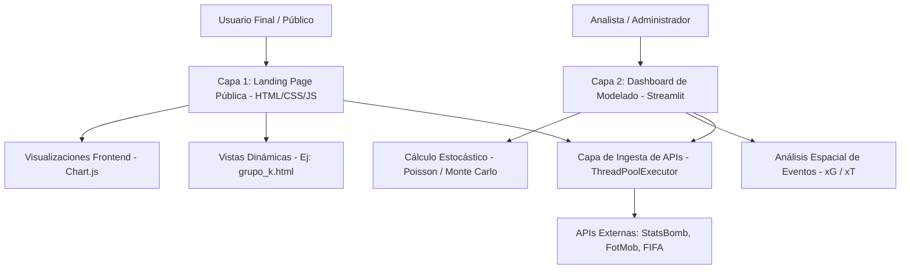

# Informe Técnico de Proyecto: Plataforma DataHacks — Mundial 2026

**Documento de Arquitectura, Funcionalidad y Casos de Uso**

---

## 1. Introducción
El presente informe documenta el diseño, desarrollo y funcionalidad de **DataHacks / ScoutingMundial**, una plataforma integral de inteligencia de datos deportivos y analítica avanzada. Este proyecto se enmarca en el contexto del Mundial de la FIFA 2026, evento que se expandirá a 48 selecciones y 104 partidos. Ante la generación masiva de métricas de rendimiento por partido, la solución propuesta unifica la ingesta de datos, el modelado probabilístico y la divulgación a través de una interfaz híbrida. El objetivo principal es transformar datos crudos espaciales en conocimiento táctico interactivo, aplicable tanto a cuerpos técnicos como a la creación de contenido en medios de comunicación.

## 2. Descripción del Problema
En la industria actual de la analítica de fútbol, se identifican tres problemáticas fundamentales:
1. **Fragmentación y Aislamiento de los Datos:** La información estadística y posicional de los jugadores se encuentra distribuida en plataformas propietarias (tales como SofaScore, FotMob y StatsBomb), obligando a los analistas a realizar prolongados procesos de extracción y limpieza.
2. **Complejidad en la Interpretación Analítica:** Las métricas de nueva generación, como los Goles Esperados (*xG*) o el Peligro Esperado (*xT*), operan sobre matrices matemáticas complejas que dificultan su adopción por parte de una audiencia general o medios de comunicación tradicionales.
3. **Carencia de Rigor Predictivo:** Gran parte del análisis periodístico y táctico se fundamenta en valoraciones empíricas o registros históricos unidimensionales, ignorando metodologías estocásticas y de Inteligencia Artificial capaces de modelar la probabilidad de éxito de manera científica.

## 3. Objetivos

### Objetivo General
Desarrollar y desplegar un ecosistema digital compuesto por una interfaz pública web y un dashboard analítico interno que permita la recolección, el modelado matemático y la visualización de los datos tácticos generados durante el Mundial 2026, empleando ciencia de datos e Inteligencia Artificial Generativa.

### Objetivos Específicos
1. Integrar y normalizar flujos de datos en tiempo real provenientes de las principales APIs del mercado deportivo (StatsBomb, FotMob, Football-Data.org).
2. Implementar funciones matemáticas, específicamente la Distribución de Poisson Bivariada y simulaciones de Monte Carlo, para evaluar la probabilidad de escenarios de partido.
3. Diseñar módulos gráficos interactivos que representen modelos de rendimiento espacial (Shot Maps y Match Momentum).
4. Establecer una arquitectura web de vanguardia que consolide el impacto visual (*glassmorphism*) con tiempos de respuesta inmediatos para el usuario final.

## 4. Justificación
El proyecto se inscribe en la revolución del *Data-Driven Football*. La provisión de este tipo de infraestructuras democratiza el acceso a la analítica predictiva. Desde una perspectiva técnica, automatizar la recolección de coordenadas y la redacción de informes tácticos mediante LLMs reduce los tiempos operativos de análisis de varias horas a apenas milisegundos. A nivel de modelo de negocio, esto habilita a medios de comunicación y creadores de contenido a mantener una cobertura exhaustiva, escalable y en tiempo real sobre los 104 partidos que componen el torneo, aportando un alto nivel de veracidad y rigor a la narrativa deportiva.

---

## 5. Diseño Básico y Arquitectura del Sistema
El sistema se ha estructurado bajo una **arquitectura híbrida de dos capas**, con el fin de satisfacer necesidades computacionales diametralmente opuestas: consumo masivo y procesamiento intensivo.

1. **Capa 1: Aplicación Comercial (`website/`):** Una landing page orientada al posicionamiento SEO y rendimiento inmediato, encargada de la divulgación visual del análisis de grupos y perfiles de selecciones.
2. **Capa 2: Panel Analítico Backend (`app.py`):** Una plataforma dinámica construida en Python enfocada en el cálculo estadístico y la generación de escenarios predictivos.

---

## 6. Características Técnicas: Backend y Frontend

### Tecnologías Frontend (Capa Comercial)
* **Maquetación e Interfaz:** Desarrollo en HTML5 semántico y CSS3 puro. Se implementó una paleta de colores de alto contraste estilo *neon-cyberpunk*, utilizando variables CSS para la generación de efectos *glassmorphism* (desenfoque de fondo y transparencias complejas).
* **Renderizado de Gráficos:** Implementación de **Chart.js** para la creación de gráficos de radar interactivos que evalúan el balance de atributos tácticos de las selecciones sin saturar el DOM.
* **Optimización de Recursos Visuales:** Uso de la API **FlagCDN** para la importación asíncrona de banderas vectoriales (SVG), mitigando la dependencia del renderizado tipográfico de emojis a nivel de sistema operativo.

### Tecnologías Backend (Procesamiento de Datos)
* **Núcleo de Cómputo:** Desarrollado bajo **Python 3.12** encapsulado en entornos virtuales dedicados (`venv`).
* **Concurrencia en Red:** Utilización de `concurrent.futures.ThreadPoolExecutor` para la ejecución de peticiones HTTP asíncronas hacia las APIs deportivas, permitiendo el scrapeo paralelo de datos y reduciendo drásticamente los cuellos de botella de red (I/O bound operations).
* **Matemática Aplicada:** Integración del módulo `scipy.stats.poisson` para calcular la distribución probabilística de resultados y el empleo de matrices iterativas en simulaciones de **Monte Carlo**, con el fin de deducir intervalos de confianza sobre posibles victorias o empates.
* **Orquestación de Lenguaje (IA):** Implementación de scripts orquestadores que actúan como puente hacia la API de Google Gemini (`gemini-2.0-flash`), delegando el análisis cualitativo automatizado de los perfiles y estadísticas recopiladas en crudo.

---

## 7. Flujo de Operación y Casos de Uso
En un entorno operativo normal, el sistema ejecuta un flujo de trabajo que consta de los siguientes procedimientos:

### 7.1. Inicialización y Validación de Ingesta
El ciclo de vida del dato comienza validando el conducto de la API. Mediante la terminal del servidor, se ejecuta el script de extracción (por ejemplo, `python test_fifa_api.py`), el cual levanta una conexión directa con las bases de datos de `football-data.org` o los endpoints de la FIFA. Este paso comprueba la correcta estructuración JSON de los eventos que alimentarán los modelos.

### 7.2. Lanzamiento del Motor de Modelado
Posterior a la validación de los pipelines de datos, se despliega el entorno analítico interactivo mediante el comando `streamlit run app.py`. Esta acción compila localmente el Dashboard Táctico, brindando acceso a módulos específicos como:
*   **Módulo Shot Maps:** Representación gráfica en un plano bidimensional de los disparos efectuados, valorados estocásticamente a través de su métrica xG.
*   **Simulador de Enfrentamientos:** Calculadora en la cual el usuario puede inferir la distribución de Poisson enfrentando estadísticamente a dos selecciones dadas.

### 7.3. Interacción del Usuario Final y Casos Prácticos (Ej: Grupo K)
Una vez generada la analítica desde el backend, el resultado es empaquetado para la visualización comercial. 
Al navegar por la Landing Page principal y acceder al análisis del **Grupo K**, el usuario encuentra un ecosistema en el que se fusionan las imágenes de los perfiles tácticos (Portugal, Colombia, RD Congo, Uzbekistán) con una comparativa estructural. 
El sistema ha calculado matemáticamente las diferencias de atributos (Defensa, Ataque, Posesión) entre selecciones e inyecta la narrativa textual proveniente de la Inteligencia Artificial, que diagnostica las debilidades y fortalezas de cada escuadra, produciendo así contenido empaquetado para el consumo digital masivo.

---

## 8. Conclusiones
1. **Escalabilidad a través de la Separación de Capas:** La estructuración del proyecto evidencia que la implementación de arquitecturas híbridas resulta óptima en el campo de *Sports Analytics*. Segregar un frontend de distribución ultrarrápida frente a un backend pesado de análisis de Streamlit asegura que ni la experiencia visual ni la profundidad de cómputo se vean comprometidas.
2. **Mitigación del Sesgo Analítico:** La adopción de variables medibles (xG, xT) integradas con distribuciones de Poisson y Monte Carlo, elimina la especulación de los pronósticos deportivos convencionales. El proyecto demuestra la fiabilidad y eficacia de cuantificar el juego de manera objetiva.
3. **Potencial de la Automatización Periodística:** La asimilación de modelos LLM para la transcripción de patrones numéricos a guiones tácticos consumibles valida el enorme potencial de automatización dentro de la generación de contenido deportivo. Esta plataforma modela cómo interactuarán las audiencias masivas con los datos del Mundial 2026 en tiempo real.
